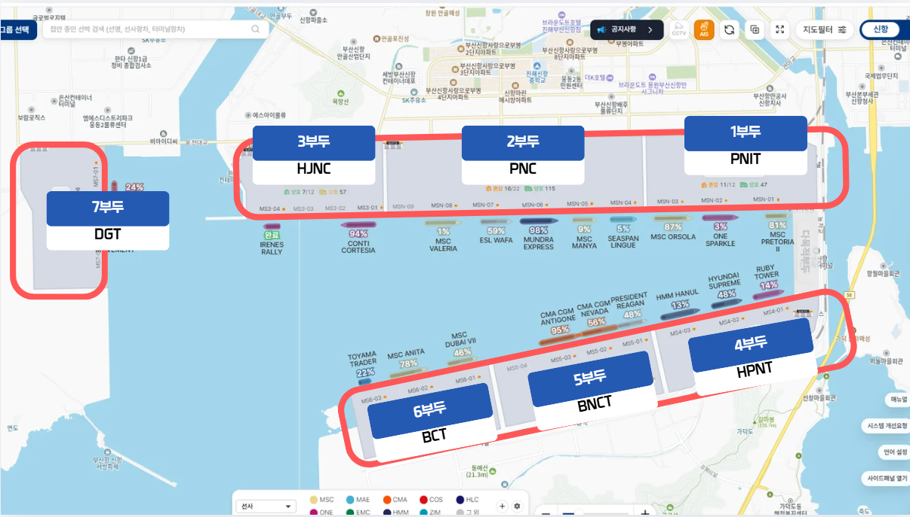
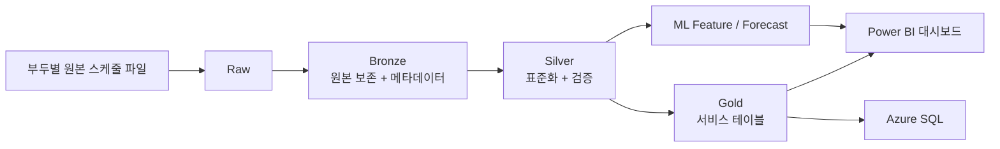
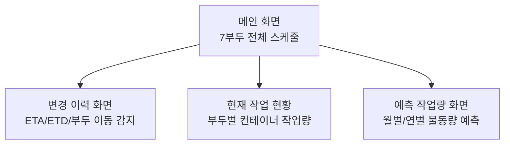
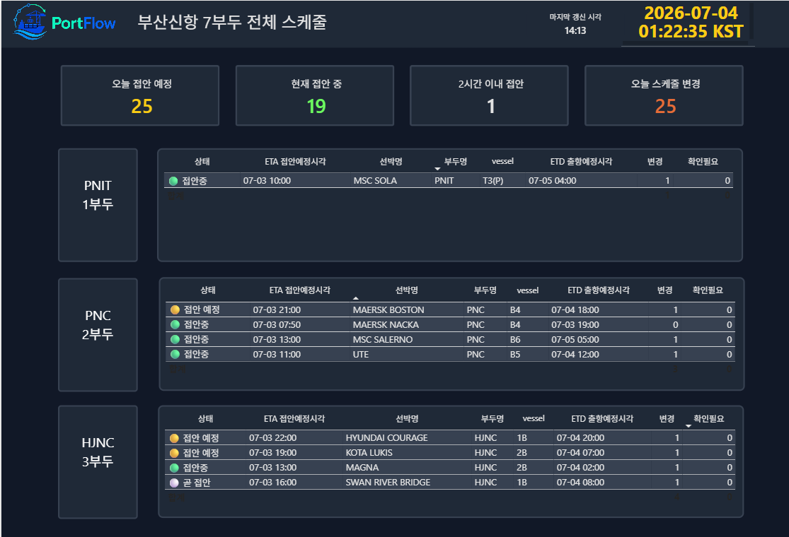
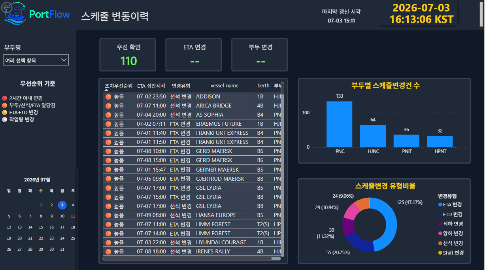
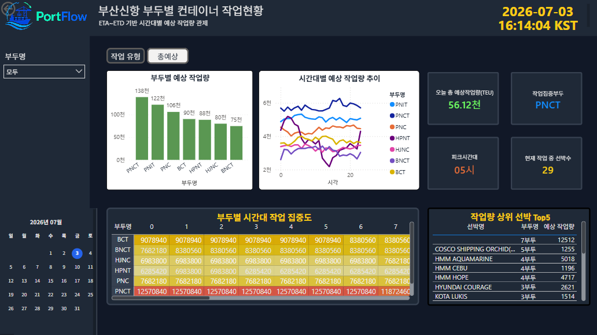
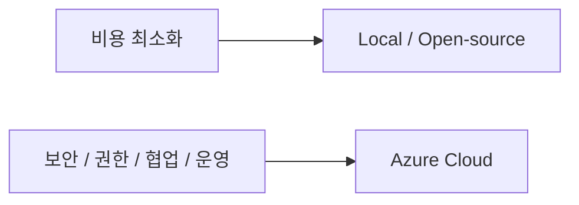
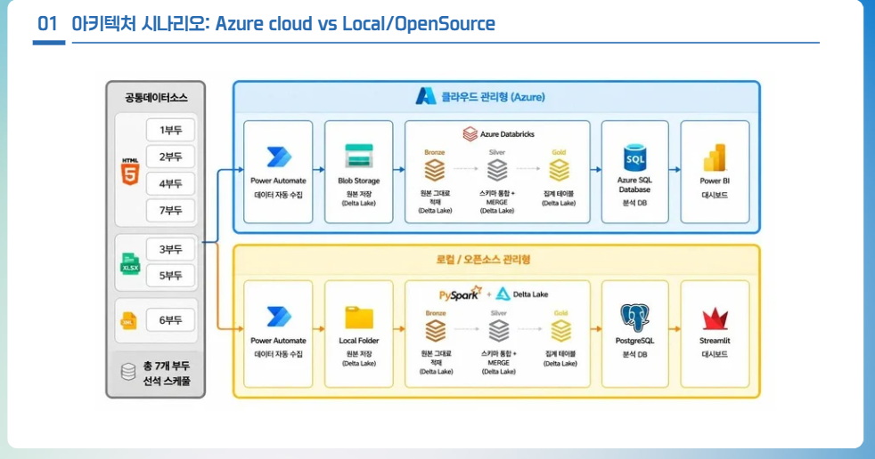

# PortFlow

> 부산신항 7개 부두의 흩어진 선석 스케줄을 통합하고,  
> 변경 감지와 작업량·물동량 예측까지 한 화면에서 제공하는 항만 운영 모니터링 서비스


부산신항 7개 부두에 흩어진 선석 스케줄을 통합하고, 변경사항과 작업량·물동량 예측 정보를 한 화면에서 확인할 수 있도록 만든 **항만 운영 모니터링 서비스**입니다.

이 프로젝트의 핵심은 기술 스택 자체가 아니라, **현직자 업무의 불편을 데이터 제품으로 전환했다는 점**입니다.  
PortFlow는 단순한 데이터 수집 자동화 프로젝트가 아니라, 현장의 업무 흐름을 기반으로 데이터 파이프라인, 변경 감지 로직, Gold 서비스 테이블, 대시보드, ML 예측 모델까지 연결한 프로젝트입니다.

## 빠르게 보기

| 항목 | 내용 |
| --- | --- |
| 프로젝트 성격 | 항만 운영 관제형 데이터 제품 |
| 핵심 문제 | 7개 부두에 흩어진 스케줄과 잦은 변경사항을 한 번에 파악하기 어려움 |
| 핵심 해결 | Medallion Architecture 기반 파이프라인 + 변경 감지 + Power BI + ML 예측 |
| 주요 사용자 | 세관, 검역, 항만 운영 담당자 |
| 핵심 가치 | 통합 조회, 변경 이력 추적, 작업량 판단, 물동량 예측 |

## 목차

- [한 줄 요약](#한-줄-요약)
- [왜 이 프로젝트를 했는가](#왜-이-프로젝트를-했는가)
- [서비스 목표](#서비스-목표)
- [핵심 기능](#핵심-기능)
- [서비스 구조](#서비스-구조)
- [데이터 아키텍처](#데이터-아키텍처)
- [중요한 설계 포인트](#중요한-설계-포인트)
- [대시보드 설계](#대시보드-설계)
- [ML 물동량 예측](#ml-물동량-예측)
- [Azure vs Local/Open-source 비교](#azure-vs-localopen-source-비교)
- [책임 있는 AI 관점](#책임-있는-ai-관점)
- [프로젝트에서 얻은 인사이트](#프로젝트에서-얻은-인사이트)
- [폴더 구조](#폴더-구조)
- [기술 스택](#기술-스택)
- [공개 저장소 안내](#공개-저장소-안내)
- [향후 개선 방향](#향후-개선-방향)

## 한 줄 요약

> “여러 부두에 흩어진 스케줄을 한 화면에서 통합하고,  
> 무엇이 바뀌었는지와 앞으로 얼마나 바빠질지를 함께 보여주는 항만 운영 서비스”

## 왜 이 프로젝트를 했는가

부산신항은 국내 컨테이너 물류의 핵심 거점이며, 스마트항만 전환과 해양·항만 데이터 활용 수요가 함께 커지고 있는 도메인입니다.



현직자 인터뷰를 통해 확인한 실제 문제는 다음과 같았습니다.

- 7개 부두 스케줄이 운영사별 사이트에 분산되어 있음
- 매일 여러 사이트에 접속해 파일을 직접 확인해야 함
- 부두별 파일 형식과 컬럼 구조가 달라 수동 취합 시간이 큼
- ETA, ETD, 부두 이동 등 주요 일정이 자주 바뀜
- 변경사항을 즉시 파악하기 어려워 현장 일정 조정 부담이 큼
- 작업량과 물동량 예측 자료도 별도로 확인해야 해 보고 업무가 비효율적임

그래서 이 프로젝트는 “데이터 품질 점검”보다, 아래 기능을 더 우선순위 높게 두고 설계되었습니다.

- 7개 부두 선석 스케줄 통합
- 1시간 단위 갱신 전제
- 스케줄 변경 감지
- 우선순위 기반 변경 확인
- 부두별 작업량과 물동량 예측 정보 제공

## 서비스 목표

PortFlow의 목표는 세관·검역·항만 운영 담당자가 매번 여러 사이트와 파일을 확인하지 않고, **한 화면에서 주요 운영 정보를 파악할 수 있도록 만드는 것**입니다.

## 핵심 기능

- 부산신항 7개 부두 스케줄 통합 조회
- ETA, ETD, Closing, 부두 이동 등 주요 변경사항 감지
- 변경 이력 및 조치 우선순위 제공
- 시간대별·부두별 예상 작업량 시각화
- 월별·연별 물동량 예측 결과 제공
- Azure Cloud와 Local/Open-source 운영 구조 비교

## 포트폴리오 포인트

- 현직자 인터뷰 기반으로 문제를 다시 정의하고 서비스 방향을 전환했습니다.
- 형식이 제각각인 부두별 원천 데이터를 하나의 표준 파이프라인으로 통합했습니다.
- business key, eta_work_date, 변경 이력 테이블 설계로 운영 관제에 필요한 추적 가능성을 확보했습니다.
- Power BI 대시보드와 ML 예측 결과를 연결해 “보는 데이터”가 아니라 “판단에 쓰는 데이터”로 확장했습니다.
- Azure와 Local/Open-source 구조를 함께 비교해 기술 선택의 근거까지 정리했습니다.

## 서비스 구조



## 데이터 아키텍처

PortFlow는 Medallion Architecture를 기반으로 설계했습니다.

| 계층 | 목적 | 주요 역할 |
| --- | --- | --- |
| Raw | 원천 데이터 수집 | 부두별 스케줄 파일 저장 |
| Bronze | 원본 보존 및 추적 | 수집 시각, 파일 정보, 스냅샷 식별 정보 관리 |
| Silver | 표준화 및 검증 | 부두별로 다른 컬럼 구조를 통일하고, 검증 실패 행 분리 |
| Gold | 서비스 테이블 생성 | 대시보드와 ML에서 바로 사용하는 통합 테이블 생성 |

## 중요한 설계 포인트

### 1. 부두별 원본 파일 형식 통일 전처리

처음에는 7개 부두가 모두 비슷한 형태의 엑셀 파일일 것이라고 예상했지만, 실제로는 형식과 구조가 제각각이었습니다.

- 일부 부두: `xlsx`
- 일부 부두: HTML 기반 `xls`
- 6부두: XML 형태 수집

그래서 Bronze 적재 전에 먼저 **헤더 규칙과 컬럼 구조를 맞춘 뒤 Parquet로 임시 저장**하고, 이후 메타데이터를 추가해 Bronze에 적재하는 흐름으로 설계했습니다.

관련 코드:
- [01_azureblob_to_bronze.py](</C:/Users/EL31/Desktop/2차 프로젝트/busan_port_project/01_schedule_pipeline/01_azureblob_to_bronze.py:1>)

### 2. 추적 가능한 Bronze 메타데이터 설계

Bronze에는 단순 적재가 아니라 추적 가능한 메타데이터를 함께 남겼습니다.

- `snapshot_id`
- `row_hash`
- `file_hash`
- `source_file_name`
- `bronze_row_id`
- `raw_row_json`

이 구조 덕분에, **언제 수집된 데이터인지**, **어떤 파일에서 왔는지**, **무엇이 바뀌었는지**를 추적할 수 있습니다.

관련 코드:
- [02_bronze_to_silver.py](</C:/Users/EL31/Desktop/2차 프로젝트/busan_port_project/01_schedule_pipeline/02_bronze_to_silver.py:1>)

### 3. business_key 기반 변경 감지

스케줄 변경 감지에서 단순 행 번호는 신뢰할 수 없습니다.  
파일 정렬이 달라지거나 중간 행이 추가되면 같은 스케줄도 다른 행으로 보일 수 있기 때문입니다.

그래서 PortFlow는 **부두, 선박, 접안예정시각, 운영일 기준 정보를 조합한 business key**를 사용해 동일 스케줄을 식별하도록 설계했습니다.

예시:

```text
terminal_2_MISB-002/2026_GJ626W/GJ626W_2026-07-03
```

### 4. eta_work_date 도입

항만 작업은 자정 이후에도 이어질 수 있기 때문에, 단순 날짜 기준만 쓰면 같은 작업 흐름이 다른 일정으로 오인될 수 있습니다.

이를 보완하기 위해 **운영일 기준 컬럼(`eta_work_date`)을 별도로 두어 야간 작업과 새벽 시간대 변경을 더 안정적으로 추적**하도록 했습니다.

### 5. Gold 서비스 테이블 분리

Gold는 단순 집계 테이블이 아니라 실제 서비스와 대시보드에서 바로 사용하기 위한 목적형 테이블로 설계했습니다.

- `gold_integrated_schedule`
- `gold_schedule_change_history`
- `gold_hourly_terminal_workload`
- `gold_today_terminal_schedule`
- `gold_explainable_ai_metrics`
- `gold_forecast_output`

관련 코드:
- [03_silver_to_gold.sql](</C:/Users/EL31/Desktop/2차 프로젝트/busan_port_project/01_schedule_pipeline/03_silver_to_gold.sql:1>)
- [01_azSQL_gold연결.py](</C:/Users/EL31/Desktop/2차 프로젝트/busan_port_project/04_dashboard_sql/01_azSQL_gold연결.py:1>)

## 대시보드 설계

PortFlow의 대시보드는 단순 시각화가 아니라 **현장 관제용 화면**을 목표로 설계되었습니다.



대시보드에서 제공하려는 핵심 가치는 다음과 같습니다.

- 오늘의 부두별 접안 현황을 한 번에 확인
- 최근 변경된 스케줄을 우선순위 관점에서 확인
- 현재 작업량과 예상 작업량을 함께 확인
- 운영 판단과 보고 업무를 동시에 지원

### 1. 메인 화면: 부산신항 7부두 전체 스케줄



한 화면에서 오늘의 접안 예정, 현재 접안 중, 2시간 이내 접안, 오늘 스케줄 변경 건수를 확인할 수 있도록 구성했습니다.

### 2. 스케줄 변경 이력 화면



ETA 변경, 부두 변경, 적하 변경, 양하 변경 등 변경 유형을 우선순위 기준으로 빠르게 확인할 수 있도록 설계했습니다.

### 3. 부두별 컨테이너 작업현황 화면



부두별 예상 작업량, 시간대별 작업량 추이, 작업 집중도, 작업량 상위 선박 정보를 함께 보여주어 운영 판단에 바로 활용할 수 있게 했습니다.

## ML 물동량 예측

ML은 단순 시계열 예측이 아니라, **항만 운영 지표 + 외부 물류 지표를 함께 반영하는 구조**로 설계했습니다.

### 예측 목표

- 부산신항 1~7부두의 월별 컨테이너 물동량 예측
- 향후 18개월 수준 예측
- 운영 판단 및 보고 업무 보조

### 모델 특징

| 항목 | 내용 |
| --- | --- |
| 모델 구조 | XGBoost Regressor + Ridge Regression 앙상블 |
| 예측 단위 | 대부분 월 단위, 3부두는 2주 단위 후 월간 합산 |
| 주요 외부 변수 | SCFI 운임 지수, 환적비, 계절성 지표 |
| 운영 변수 | 선석 점유율, 선박 수, 평균 정박 시간, Shift 비율 |
| 모델 관리 | Databricks 환경에서 MLflow 추적 구조 고려 |

### 3부두를 별도 처리한 이유

3부두는 누적 데이터 기간이 짧고 변동성이 커서, 월 단위만으로는 오차가 커질 수 있었습니다.  
그래서 **2주 단위로 더 세밀하게 예측한 뒤 월간으로 합산**하는 방식을 적용했습니다.

관련 코드:
- [databricks_예측.py](</C:/Users/EL31/Desktop/2차 프로젝트/busan_port_project/03_ml_teu_prediction/databricks_예측.py:1>)

## Azure vs Local/Open-source 비교

이 프로젝트는 단순히 Azure 기반으로 만들고 끝난 것이 아니라, **실제 운영을 가정했을 때 Azure Cloud와 Local/Open-source 중 어떤 구조가 더 적합한지 비교**했다는 점도 중요한 포인트입니다.

### 비교 결론

- 비용 최소화가 최우선인 MVP·소규모 실험: `Local / Open-source`
- 보안, 권한, 감사 로그, 협업이 중요한 운영 환경: `Azure Cloud`
- 다수 사용자가 대시보드를 공유해야 하는 환경: `Azure + Power BI` 검토 필요

핵심은, **비용만 보면 Local이 유리할 수 있지만, 운영 안정성·권한 관리·감사 로그·협업까지 고려하면 Azure의 장점이 분명해진다**는 점입니다.





## 책임 있는 AI 관점

PortFlow의 ML 결과는 자동 의사결정을 대체하는 용도가 아니라, **운영 판단을 보조하는 참고 자료**로 설계했습니다.

- 공식 또는 공개된 부두 스케줄 데이터를 기반으로 투명성 확보
- 부적절한 데이터는 Silver 단계에서 검증 및 분리
- 예측 결과는 담당자의 판단을 대체하지 않고 보조자료로 제공
- 부두별 예측 성능을 분리해 특정 부두의 오차를 전체 성능으로 숨기지 않음
- MLflow 기반 추적으로 모델 실행 이력과 결과 관리 가능성 확보

## 프로젝트에서 얻은 인사이트

### 1. 현업 인터뷰는 기능 우선순위를 바꾼다

초기 아이디어보다 실제 사용자의 업무 흐름이 더 중요했습니다.  
현직자 인터뷰를 통해 데이터 품질 리포트보다 **통합 스케줄과 변경 감지**가 더 시급한 문제라는 점을 확인했습니다.

### 2. 데이터 표준화는 대시보드보다 먼저다

7개 부두의 파일 형식과 컬럼 구조가 다른 상황에서는, 대시보드 이전에 표준화 계층이 필요했습니다.  
Bronze/Silver/Gold 구조는 단순 정리가 아니라 **운영 가능한 데이터 흐름을 만들기 위한 설계**였습니다.

### 3. 변경 감지는 단순 비교가 아니다

행 번호나 정렬 순서는 언제든 바뀔 수 있습니다.  
그래서 업무 기준으로 동일 스케줄을 식별할 수 있는 business key가 필요했습니다.

### 4. 인프라 비교는 비용만으로 끝나지 않는다

Local은 비용 측면에서 강점이 있지만, 실제 운영 환경에서는 보안, 권한, 감사 로그, 장애 대응, 협업까지 함께 봐야 합니다.

### 5. 예측 모델은 설명 가능한 운영 변수와 함께 가야 한다

항만 물동량 예측은 단순한 시계열 문제가 아니라, 선석 점유율, 선박 수, 체류 시간, 환적비, 운임 지수 같은 도메인 변수를 함께 봐야 현업 설득력이 생깁니다.

## 폴더 구조

```text
busan_port_project
├─ 00_setup
│  ├─ 01_azurecontainter_권한부여.py
│  └─ 02_패키지 및 라이브러리.py
├─ 01_schedule_pipeline
│  ├─ 01_azureblob_to_bronze.py
│  ├─ 02_bronze_to_silver.py
│  ├─ 03_silver_to_gold.sql
│  └─ 04_파이프라인 실행전후비교.sql
├─ 03_ml_teu_prediction
│  ├─ databricks_예측.py
│  └─ databricks_예측 2026-07-01 05_56_05.py
├─ 04_dashboard_sql
│  └─ 01_azSQL_gold연결.py
├─ PUBLIC_REPO_SETUP.md
└─ README.md
```

## 기술 스택

- Databricks
- Python
- SQL
- Pandas
- PySpark
- Azure Blob Storage / ADLS Gen2
- Azure SQL Database
- Power BI
- XGBoost
- MLflow

## 공개 저장소 안내

이 저장소는 포트폴리오 공개용으로 민감한 인프라 식별자와 비밀값을 제거한 상태입니다.  
실행에 필요한 환경 변수와 설정값은 [PUBLIC_REPO_SETUP.md](</C:/Users/EL31/Desktop/2차 프로젝트/busan_port_project/PUBLIC_REPO_SETUP.md:1>)를 참고해 직접 채워야 합니다.

## 향후 개선 방향

### 데이터 수집

- Power Automate 수동 설정 의존도 축소
- Python 기반 수집 또는 정식 스케줄러로 고도화
- 부두별 사이트 구조 변경 대응용 예외 처리 강화
- 원본 파일 백업 및 재처리 프로세스 정리

### 데이터 파이프라인

- Databricks Job 기반 정기 실행 구조 구축
- Silver 검증 규칙 고도화
- Gold/Mart 테이블 역할 분리
- 운영용 데이터와 실험용 데이터 분리

### 보안·권한

- Microsoft Entra ID 기반 사용자·그룹 권한 분리
- Azure SQL DB 내부 Role 분리
- 조회 사용자와 적재/관리 사용자 분리
- Secret Scope 기반 접속 정보 관리
- 감사 로그 및 접근 이력 모니터링 강화

### ML

- 부두별 모델 성능 추적 고도화
- 예측 결과 신뢰구간 또는 위험도 표시 추가
- 데이터 누적 후 재학습 전략 정리
- MLflow 기반 모델 버전 관리와 배포 흐름 구체화

### 대시보드

- 변경 우선순위 기준 고도화
- 현직자 피드백 반영 화면 개선
- 운영자 권한별 화면 분리
